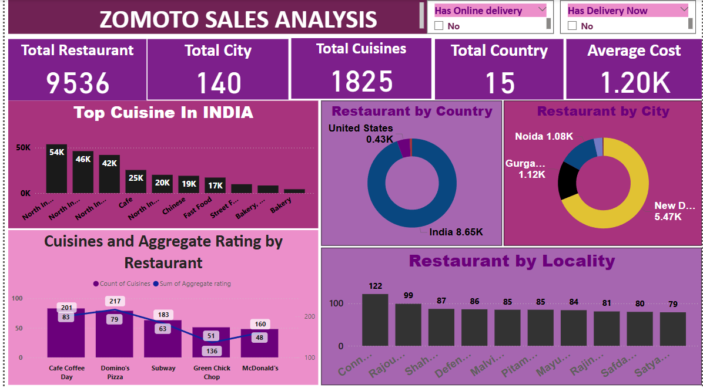

# Analysis-Zomato-data-with-python and Visualization with Power-Bi

## Project Objective
In this project, we investigate a dataset that carries approximate facts about restaurant chains all over the world. The project's main aim is to perform descriptive and statistical analysis based on a few goals designed.

## Dataset
The dataset provides information like an average cost for two, location, votes, the aggregate rating, cuisines, country, rating text, etc. Various analysis like the top cuisines, most expensive restaurants, average rating for each country, and many other analysis are performed on the dataset.
The dataset's owner is Zomato and Kaggle is the source providing the data.

## Zamoto Analysis
* Load the Raw Data.
* Data cleaning is performed on Python libraries Numpy, and pandas.
* Made sure data is Dropping unnecessary columns, Dropping duplicate rows, and Cleaning individual rows.
* Cleaned the data, and it is ready for developing the Interactive Dashboard.

## Questions
The analysis that we are going to perform shall answer the following questions:

* Total restaurants and total cuisines all over the world?
* Which countries have the greatest number of restaurants enrolled in Zomato?
* Which cities in India have the greatest number of "value for money restaurants?
* What are the top 10 cuisines that have the highest number of votes in India.?
* Which countries have restaurants that deliver online?
* In terms of the number of restaurants, which locality has the most?
* Which Restaurants have Good Cuisine and an average rating?

## Dashboard 

## Conclusion
* The dataset shows the restaurants with the highest cost for two, countries with a greater number of restaurants on Zomato, countries with 
  restaurants that offer online delivery, average aggregate rating for countries, etc.
* Based on our analysis performed, the restaurants present in different localities can improve the quality of the restaurant, deliver online,work on days that have an average aggregate rating, 
  and check for value-added restaurants to check on how they work and can implement a few techniques like including both online delivery and table booking, providing various cuisines to 
  visitors, etc.
* It is easy for frequent visitor's filter based on the average cost for two, votes, the aggregate rating, cuisines, etc. This can be done before 
  visiting the restaurant
